# [Prompt Engineering Practical Approach]()

This repo has the goal to give a practical and intuitive way for using prompt depending on the knowledge and requirements. The scope of this guideline is general. But mainly the developement process will use as a example
In addition the application of the approach is related for the examples with Github Copilot.

## Getting Started

This quadrant approach is straightforward. First, it's necessary to understand that most problems you encounter when using LLM chats involve two controlled factors:

1. **Knowledge about the topic**: How much you know about the topic addressed in the question.
2. **Requirements for the question's objective**: Does your question aim to solve or respond to something specific, and do you have all the necessary requirements for an efficient response?

These two factors can be visualized in a quadrant chart, creating four main zones. Each zone corresponds to different approaches in prompt engineering.

```mermaid
quadrantChart
    title Quadrant for Prompting Approach 🤖
    x-axis Low Knowledge --> High Knowledge
    y-axis Unclear Requirements --> Clear Requirements
    quadrant-1 Zero/One shot 
    quadrant-2 Full Prompt 
    quadrant-3 Multi Prompt
    quadrant-4 Reverse Prompt/CoT 
```

The details of the quadrant and the reasons behind each approach can be explored further in the following section.

## Tree Knowledge

1. [Base knowledge for prompt engineering patterns](https://github.com/ovas04/quadrant-dev-prompt-engineering/blob/main/docs/base_knowledge_pe.md#base-knowledge-for-prompt-engineering-patterns)  
   This section covers foundational patterns in prompt engineering, explaining how each pattern works and its benefits.

2. [Quadrant for prompt engineering](https://github.com/ovas04/quadrant-dev-prompt-engineering/blob/main/docs/quadrant_ep.md#quadrant-for-prompt-engineering)  
   This section introduces a quadrant framework to help select the appropriate prompting approach based on knowledge level and requirement clarity.

3. [Examples and uses](https://github.com/ovas04/quadrant-dev-prompt-engineering/blob/main/docs/examples_ep.md#examples-and-uses)  
   This section provides practical examples illustrating how to identify the appropriate quadrant and prompting approach for different scenarios.

> [!IMPORTANT]  
> It's important to better understand prompt engineering patterns, so the first section is recommended as initial reading

## Other Knowdelge source realted and recommended

* [Introduction to prompt engineering with GitHub Copilot](https://learn.microsoft.com/en-us/training/modules/introduction-prompt-engineering-with-github-copilot/6-summary#completion)
*   [Inside GitHub: Working with the LLMs behind GitHub Copilot](https://github.blog/ai-and-ml/github-copilot/inside-github-working-with-the-llms-behind-github-copilot/)
*   [Prompt Engineering Github](https://docs.github.com/en/copilot/using-github-copilot/prompt-engineering-for-github-copilot)
