# [Examples and uses](https://github.com/ovas04/quadrant-dev-prompt-engineering/blob/main/docs/examples_ep.md#examples-and-uses)

In this section, the process of identifying the sector in the quadrant based on the context of the problems will be demonstrated. The following numbered cases illustrate this process:

```mermaid
quadrantChart
    title Quadrant for Prompting Approach 🤖
    x-axis Low Knowledge --> High Knowledge
    y-axis Not Unclear Requirements --> Clear Requirements
    quadrant-1 Zero/One shot 
    quadrant-2 Full Prompt 
    quadrant-3 Multi Prompt
    quadrant-4 Reverse Prompt/CoT 
    case-1: [0.80, 0.25]
    case-2: [0.25, 0.80]
    case-3: [0.35, 0.25]
    case-4: [0.75, 0.75]
    case-5: [0.5, 0.5]
    case-6: [0.25, 0.7]
    case-7: [0.7, 0.3]
    case-8: [0.2, 0.2]
    case-9: [0.8, 0.85]
```

---
### Case 1

\- $${\color{lightgreen}Situation: }$$ I am an expert at making APIs. They asked me to make an API, and I feel too lazy to think about the requirements.

\- $${\color{skyblue}Prompt \space Approach: }$$ Reverse Prompt/CoT

\- $${\color{orange}Reason: }$$ Because in this scenario, we have **High Knowledge** and **Unclear Requirements**.

---
### Case 2

\- $${\color{lightgreen}Situation: }$$ I have never made a microservice, but I have all the technical details I need to do it.

\- $${\color{skyblue}Prompt \space Approach: }$$ Full prompt

\- $${\color{orange}Reason: }$$ Because in this scenario, we have **Low Knowledge** and **Clear Requirements**.

---
### Case 3

\- $${\color{lightgreen}Situation: }$$ I never learned how to create a data model, and I am not clear on what is needed.

\- $${\color{skyblue}Prompt \space Approach: }$$ Multi Prompt

\- $${\color{orange}Reason: }$$ Because in this scenario, we have **Low Knowledge** and **Unclear Requirements**.

---
### Case 4

\- $${\color{lightgreen}Situation: }$$ I am a frontend expert, and they asked me to do something very easy. I don’t even need to ask for the requirements.

\- $${\color{skyblue}Prompt \space Approach: }$$ Zero/One shot

\- $${\color{orange}Reason: }$$ Because in this scenario, we have **High Knowledge** and **Clear Requirements**.

---
### Case 5

\- $${\color{lightgreen}Situation: }$$ Uhmmm, I am an expert developer, but I don’t know what I’m doing here, and I didn’t understand anything. But let’s go for it.

\- $${\color{skyblue}Prompt \space Approach: }$$ Freedom

\- $${\color{orange}Reason: }$$ Because the person is not sure about anything in a dynamic scenario.

---
### Caso 6

\- $${\color{lightgreen}Situation: }$$ I am learning to program in Python, and I need to develop a script following clear instructions.

\- $${\color{skyblue}Prompt \space Approach: }$$ Full prompt

\- $${\color{orange}Reason: }$$ Because in this scenario, we have **Low Knowledge** and **Clear Requirements**.

---
### Case 7

\- $${\color{lightgreen}Situation: }$$ I am an expert in cybersecurity, but I have no details about what kind of tests they expect me to perform.

\- $${\color{skyblue}Prompt \space Approach: }$$ Reverse Prompt/CoT

\- $${\color{orange}Reason: }$$ Because in this scenario, we have **High Knowledge** and **Unclear Requirements**.

---
### Case 8

\- $${\color{lightgreen}Situation: }$$ I have no experience in artificial intelligence, and the expectations are unclear.

\- $${\color{skyblue}Prompt \space Approach: }$$ Multi Prompt

\- $${\color{orange}Reason: }$$ Because in this scenario, we have **Low Knowledge** and **Unclear Requirements**.

---
### Case 9

\- $${\color{lightgreen}Situation: }$$ I am an expert web developer, and I was asked to make a simple contact page.

\- $${\color{skyblue}Prompt \space Approach: }$$ Zero/One shot

\- $${\color{orange}Reason: }$$ Because in this scenario, we have **High Knowledge** and **Clear Requirements**.

---

🏠 [Return Tree](https://github.com/ovas04/quadrant-dev-prompt-engineering#prompt-engineering-practical-approach)

⏮️ [Previous Section - Quadrant for prompt engineering](https://github.com/ovas04/quadrant-dev-prompt-engineering/blob/main/docs/quadrant_ep.md#quadrant-for-prompt-engineering)

---

