## [Quadrant for prompt engineering]()

This section explains the rationale behind each sector in the quadrant chart and how it relates to the selected prompting pattern approach.  

```mermaid
quadrantChart
    title Quadrant for Prompting Approach 🤖
    x-axis Low Knowledge --> High Knowledge
    y-axis Not Unclear Requirements --> Clear Requirements
    quadrant-1 Zero/One shot 
    quadrant-2 Full Prompt 
    quadrant-3 Multi Prompt
    quadrant-4 Reverse Prompt/CoT 
```

## [High Knowledge and Clear Requirements]() 

\-  $${\color{lightgreen}Recommended \space Pattern:  \space Zero/One  \space Shot }$$  

When you have a strong understanding of the topic and well-defined requirements, simplicity and efficiency take center stage. This pattern works best because:  
- Your expertise enables precise communication of technical needs.  
- Clear requirements eliminate the need for additional clarification.  
- The focus is on minimizing time-to-solution.  
- Complex back-and-forth interactions would be redundant and inefficient.  

**Why This Pattern Is Ideal**:  
The main goal of the Zero/One Shot pattern is to quickly and accurately deliver a solution without unnecessary exploration. Given the user's knowledge and clarity, this pattern ensures the fastest path to the desired outcome.  

**Example Scenario**:  
An experienced ML engineer needs to implement a specific CNN architecture with defined hyperparameters. They can directly request:  
*"Generate a PyTorch CNN with 3 convolutional layers, batch normalization, and ReLU activation."*  

> [!WARNING]  
> In high-knowledge, clear-requirement scenarios, focus on using precise technical language. Ambiguities may cause the LLM to provide unnecessary options or interpretations.  

---

## [High Knowledge and Unclear Requirements]()  

\-  $${\color{lightgreen}Recommended \space Pattern:  \space Reverse  \space Prompt/Chain \space of \space Thought (CoT) }$$  

In this situation, where you’re knowledgeable but unsure about all the details, thess patterns shines by blending expertise with exploratory thinking. Here’s why:  
- It allows you to validate each step of the LLM’s reasoning.  
- The LLM helps uncover edge cases or hidden requirements you may not have considered.  
- Chain of Thought reasoning exposes potential conflicts early.  
- Your domain knowledge helps refine ideas and address misconceptions quickly.  

**Why This Pattern Is Ideal**:  
The goal of Reverse Prompt/CoT is to guide discovery and refine understanding step by step. By using your expertise as a foundation, this pattern uncovers missing details while iteratively clarifying goals.  

**Example Scenario**:  
An experienced backend developer is designing a new API structure. The LLM can guide the process by asking targeted questions about authentication methods, rate limiting, and caching strategies, while you validate and refine each decision.  

> [!WARNING]  
> When requirements are unclear, it’s easy to overlook critical elements. Regularly step back to evaluate whether the questions or responses are addressing the full scope of the problem.  

---

## [Low Knowledge and Clear Requirements]()  

\-  $${\color{lightgreen}Recommended \space Pattern:  \space Full \space Prompt }$$  

This pattern compensates for limited expertise by providing structure and clarity. It’s particularly effective because:  
- Well-defined requirements serve as a roadmap for the LLM, minimizing reliance on your knowledge.  
- Step-by-step instructions reduce the chance of missed details.  
- You can include examples and constraints to focus the LLM's output.  
- Acceptance criteria ensure the final output aligns with your needs.  

**Why This Pattern Is Ideal**:  
The Full Prompt pattern’s primary objective is to leverage detailed instructions to compensate for a lack of knowledge. With clear requirements, this ensures the output aligns perfectly with the user’s needs despite their expertise gap.  

**Example Scenario**:  
A frontend developer is tasked with implementing complex financial calculations and have all requirements. He can supply expected behaviors, even without deep domain knowledge of finance.

> [!IMPORTANT]  
> When knowledge is limited, detailed requirements are your safety net. Ensure every detail is explicitly documented to avoid gaps in the LLM's understanding.  

---

## [Low Knowledge and Unclear Requirements]()  

\-  $${\color{lightgreen}Recommended \space Pattern:  \space Multi \space Prompt }$$  

When you’re navigating a new topic and unsure about your objectives, this pattern excels by building understanding iteratively. Its benefits include:  
- Breaking down complex problems into manageable pieces.  
- Allowing you to learn and refine requirements progressively.  
- Supporting both knowledge discovery and goal clarification.  
- Minimizing misunderstandings through frequent feedback loops.  

**Why This Pattern Is Ideal**:  
The Multi Prompt pattern focuses on managing complexity and iteratively building knowledge and clarity. It excels in guiding users through exploration while gradually uncovering both the problem space and the requirements.  

**Example Scenario**:  
A developer new to Kubernetes is designing a microservices deployment. Each interaction with the LLM helps them learn about the technology while refining deployment requirements, ensuring they gradually gain both knowledge and clarity.  

> [!WARNING]  
> In scenarios with low knowledge and unclear requirements, there’s a risk of falling into circular exploration. Set intermediate goals to keep the process focused and prevent unnecessary iterations.  

--- 
## [Five Hipotetical Quadrant]() 

There could be an existing question about medium knowledge and moderately clear requirements. Consequently, this situation could appear if the person is not sure about their knowledge or requirements. So, it’s considered that this zone is a helpful or freedom zone because the person needs to decide through introspection which quadrant or zone is more appropriate. In this case, the person could accept that they don’t have enough knowledge or don’t have enough understanding about the requirements.

---

⏭️ [Next Section - Examples and uses](https://github.com/ovas04/quadrant-dev-prompt-engineering/blob/main/docs/examples_ep.md#examples-and-uses)

🏠 [Return Tree](https://github.com/ovas04/quadrant-dev-prompt-engineering#prompt-engineering-practical-approach)

⏮️ [Previous Section - Base knowledge for prompt engineering patterns](https://github.com/ovas04/quadrant-dev-prompt-engineering/blob/main/docs/base_knowledge_pe.md#base-knowledge-for-prompt-engineering-patterns)

---
